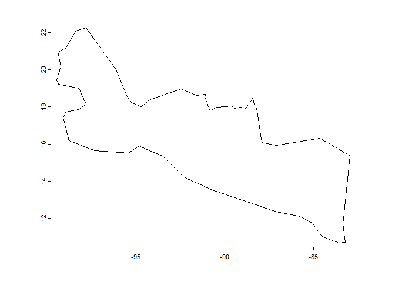
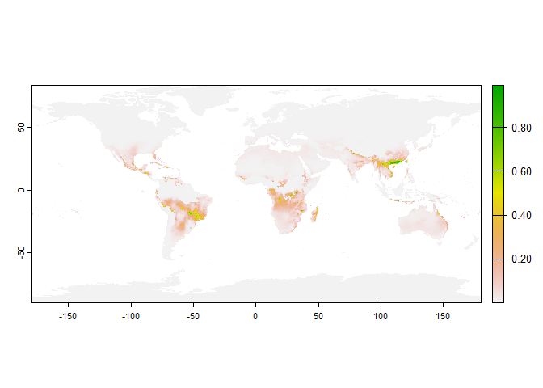

<!-- README.md is generated from README.Rmd. Please edit that file -->

# nicher

<!-- badges: start -->
<!-- badges: end -->

The goal of nicher is to create ecological niche models based on an
ellipse model

## Installation

You can install the development version of nicher from
[GitHub](https://github.com/) with:

``` r
# install.packages("devtools")
devtools::install_github("alrobles/nicher")
```

## Example

This is a basic example which shows you how to solve a common problem.
First we get the shapefile of an accesibility area (M):

``` r
library(nicher)
library(terra)
#> Warning: package 'terra' was built under R version 4.2.3
#> terra 1.7.39


M_path <- system.file("extdata", "Mshp_test.rds", package="nicher")
Mshp <- terra::unwrap(readr::read_rds(M_path))
plot(Mshp)
```



Then we get environmental variables to model:

``` r

stack_path <- system.file("extdata", "stack_1_12_crop.rds", package="nicher")
stack_1_12 <- terra::unwrap(readr::read_rds(stack_path))
stack_1_12_19 <- get_example_data("stack_1_12_19")
```

We get the parameters of the ellipse:

``` r

pars <-  get_ENM_par(rawSpOccPnts, stack_1_12_19, Mshp, method = "mahalanobis")
```

Then we plot the ellipse in 2d comparassions:


Finally we predict the suitability given environmental data:

