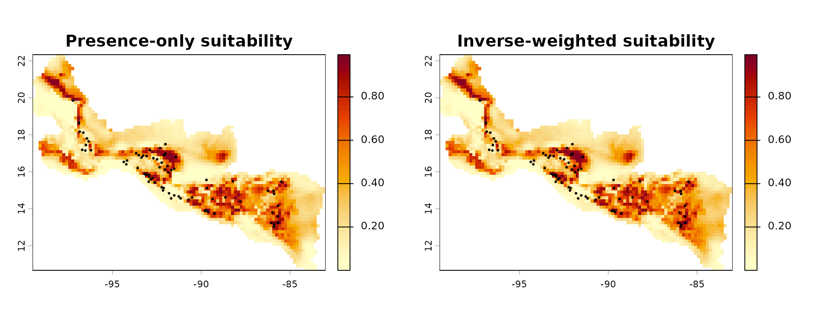
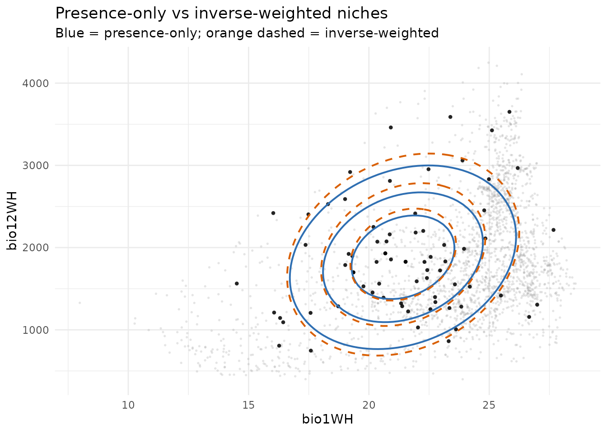

# Package Workflow: End-to-End Niche Fitting and Projection

## Overview

This vignette walks through the complete `nicher` workflow: loading
environmental data, fitting niche models, comparing them with
information criteria, projecting habitat suitability onto geographic
space, and extracting the estimated ellipsoid parameters.

## 1 Load data

The package ships with cropped rasters and occurrence records for the
Emerald-bellied Hummingbird (*Abeillia abeillei*).

``` r

library(nicher)
library(terra)
#> terra 1.9.25

stack_path <- system.file("extdata", "stack_1_12_crop.rds",
                          package = "nicher")
env_rasters <- readRDS(stack_path)
data(example_occ_df, package = "nicher")
```

## 2 Extract environmental values

Occurrence records are longitude/latitude coordinates. We extract raster
values at those points (`env_occ`) and use every non-`NA` cell as the
accessible background (`env_m`).

``` r

occ_points <- terra::vect(example_occ_df, geom = c("lon", "lat"),
                          crs = "EPSG:4326")

env_occ <- terra::extract(env_rasters, occ_points, ID = FALSE)
env_occ <- stats::na.omit(as.data.frame(env_occ))

env_m <- stats::na.omit(as.data.frame(terra::values(env_rasters)))

str(env_occ)
#> 'data.frame':    73 obs. of  2 variables:
#>  $ bio1WH : num  20.7 22.4 22.3 19.3 23.9 ...
#>  $ bio12WH: num  2075 1630 2203 1897 3060 ...
str(env_m)
#> 'data.frame':    2371 obs. of  2 variables:
#>  $ bio1WH : num  24.5 24.2 24.3 25.2 24.9 ...
#>  $ bio12WH: num  934 971 1013 826 925 ...
#>  - attr(*, "na.action")= 'omit' Named int [1:4559] 1 2 3 4 5 6 7 8 12 13 ...
#>   ..- attr(*, "names")= chr [1:4559] "1" "2" "3" "4" ...
```

## 3 Fit niche models

[`optimize_niche()`](https://alrobles.github.io/nicher/reference/optimize_niche.md)
is the main entry point. We fit a presence-only model and an
inverse-weighted model that corrects for sampling bias in the accessible
environment.

``` r

set.seed(42)

fit_po <- optimize_niche(
  env_occ    = env_occ,
  env_m      = NULL,
  likelihood = "presence_only",
  num_starts = 3L,
  seed       = 42L,
  control    = list(maxeval = 1000L),
  verbose    = FALSE
)

fit_ipw <- optimize_niche(
  env_occ    = env_occ,
  env_m      = env_m,
  likelihood = "ip_weighted",
  num_starts = 3L,
  seed       = 42L,
  control    = list(maxeval = 150L),
  verbose    = FALSE,
  grad       = "analytic"
)
#> Warning in create_niche_obj_ptr(env_occ = env_occ_mat, env_m = env_m_mat, :
#> grad = 'analytic' is not yet implemented for likelihood = 'presence_only';
#> falling back to grad = 'central'.
#> Warning in create_niche_obj_ptr(env_occ = env_occ_mat, env_m = env_m_mat, :
#> grad = 'analytic' is not yet implemented for likelihood = 'presence_only';
#> falling back to grad = 'central'.
#> Warning in create_niche_obj_ptr(env_occ = env_occ_mat, env_m = env_m_mat, :
#> grad = 'analytic' is not yet implemented for likelihood = 'presence_only';
#> falling back to grad = 'central'.

fit_po
fit_ipw
#> -- nicher optimization result --
#>   Likelihood : presence_only 
#>   Starts     : 3 (converged: 3 )
#>   Best loglik: -621.8936 
#>   Convergence: 1 
#>   eta        : 1 
#>   Variables  : bio1WH, bio12WH 
#> -- nicher optimization result --
#>   Likelihood : ip_weighted 
#>   Starts     : 4 (converged: 4 )
#>   Best loglik: -524.229 
#>   Convergence: 1 
#>   eta        : 1 
#>   Variables  : bio1WH, bio12WH
```

## 4 Convergence diagnostics

The [`assess()`](https://alrobles.github.io/nicher/reference/assess.md)
generic checks whether multiple starts converged to the same optimum. A
`"converged"` flag means all starts agree within tolerance.

``` r

assess(fit_po)$flag
#> [1] "accepted_global"
assess(fit_ipw)$flag
#> [1] "accepted_global"
```

## 5 Model comparison

[`compare_nicher()`](https://alrobles.github.io/nicher/reference/compare_nicher.md)
tabulates log-likelihood, AIC, BIC, and Akaike weights across competing
fits.

``` r

cmp <- compare_nicher(
  presence_only  = fit_po,
  ip_weighted    = fit_ipw
)
print(cmp[, c("model", "likelihood", "AIC", "dAIC", "BIC", "dBIC")])
#>           model    likelihood      AIC     dAIC     BIC     dBIC
#> 1   ip_weighted   ip_weighted 1058.458   0.0000 1069.91   0.0000
#> 2 presence_only presence_only 1253.787 195.3292 1265.24 195.3292
```

## 6 Extract ellipsoid parameters

[`get_ellipsoid_pars()`](https://alrobles.github.io/nicher/reference/get_ellipsoid_pars.md)
computes the sample mean and covariance from the occurrence data — a
useful baseline for the niche ellipsoid:

``` r

pars_sample <- get_ellipsoid_pars(env_occ)
pars_sample$mu
#>     bio1WH    bio12WH 
#>   21.41451 1882.60274
pars_sample$s_mat
#>             bio1WH     bio12WH
#> bio1WH    8.073574    433.5456
#> bio12WH 433.545626 455709.4650
```

The fitted models refine these estimates via maximum likelihood. The
optimized parameter vector is stored in `fit$best$theta` and used
internally by
[`predict()`](https://rspatial.github.io/terra/reference/predict.html)
when projecting suitability onto rasters.

## 7 Project habitat suitability

The
[`predict()`](https://rspatial.github.io/terra/reference/predict.html)
method projects the fitted niche onto environmental rasters, producing a
geographic suitability map with values in $`(0, 1]`$.

``` r

suit_po  <- predict(fit_po,  env_rasters)
suit_ipw <- predict(fit_ipw, env_rasters)
```

### Side-by-side comparison

``` r

op <- par(mfrow = c(1, 2), mar = c(3, 3, 3, 5))
plot(suit_po,
     main = "Presence-only suitability",
     col = hcl.colors(50, "YlOrRd", rev = TRUE))
points(example_occ_df$lon, example_occ_df$lat, pch = 20, cex = 0.45)
plot(suit_ipw,
     main = "Inverse-weighted suitability",
     col = hcl.colors(50, "YlOrRd", rev = TRUE))
points(example_occ_df$lon, example_occ_df$lat, pch = 20, cex = 0.45)
```



``` r

par(op)
```

The inverse-weighted model typically produces a tighter niche estimate
because it down-weights regions of environmental space that are
over-represented in the background.

## 8 Iso-suitability contours in environmental space

``` r

library(ggplot2)

ggplot() +
  geom_nicher_background(env_m, size = 0.35, alpha = 0.18) +
  geom_nicher_occ(env_occ, size = 1.2, alpha = 0.85) +
  geom_nicher_isosuitability(
    fit_po,
    level = c(0.75, 0.5, 0.25),
    colour = "#2f6fb2",
    linewidth = 0.7
  ) +
  geom_nicher_isosuitability(
    fit_ipw,
    level = c(0.75, 0.5, 0.25),
    colour = "#d95f02",
    linetype = "dashed",
    linewidth = 0.7
  ) +
  labs(
    title = "Presence-only vs inverse-weighted niches",
    subtitle = "Blue = presence-only; orange dashed = inverse-weighted",
    x = names(env_occ)[1],
    y = names(env_occ)[2]
  ) +
  theme_minimal()
```



## References

Jimenez, L., Soberon, J., Christen, J. A., & Soto, D. (2022). Dealing
with critical uncertainty in ecological niche models. *Ecological
Modelling*, 468, 109823.
<https://doi.org/10.1016/j.ecolmodel.2021.109823>

Jimenez, L. & Soberon, J. (2022). Weighted likelihood estimation of the
fundamental niche. *Ecological Modelling*, 470, 110009.
<https://doi.org/10.1016/j.ecolmodel.2022.110009>
