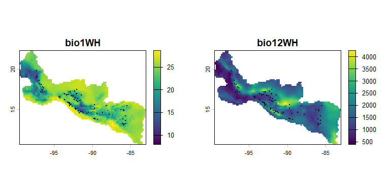
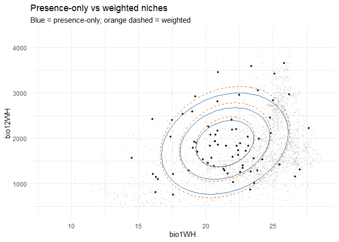

# nicher


`nicher` estimates ecological niche models with ellipsoidal
environmental responses under the *M* hypothesis. It includes symmetric
Gaussian models, background-weighted models, and non-symmetric
skew-normal and skew-t models for niches with asymmetric or heavy-tailed
environmental responses.

## Installation

You can install the development version of nicher from
[GitHub](https://github.com/) with:

``` r

# install.packages("devtools")
devtools::install_github("alrobles/nicher")
```

## Quick start

`nicher` ships with a small cropped raster stack and occurrence records
for the Emerald-bellied Hummingbird (*Abeillia abeillei*). This example
reads those files, fits two baseline niche models, and overlays their
iso-suitability contours in environmental space.

### Load the package, rasters, and occurrences

``` r

library(nicher)
library(terra)
#> terra 1.9.11
library(ggplot2)

stack_path <- system.file("extdata", "stack_1_12_crop.rds",
                          package = "nicher")
env_rasters <- readRDS(stack_path)
data(example_occ_df, package = "nicher")

env_rasters
#> class       : SpatRaster 
#> size        : 70, 99, 2  (nrow, ncol, nlyr)
#> resolution  : 0.1666667, 0.1666667  (x, y)
#> extent      : -99.5, -83, 10.66667, 22.33333  (xmin, xmax, ymin, ymax)
#> coord. ref. : lon/lat WGS 84 (EPSG:4326) 
#> source(s)   : memory
#> names       :    bio1WH, bio12WH 
#> min values  :  7.985291,     399 
#> max values  : 28.588655,    4249
head(example_occ_df)
#>             species     lon    lat
#> 1 Abeillia abeillei -92.933 15.733
#> 2 Abeillia abeillei -93.192 15.880
#> 3 Abeillia abeillei -92.632 15.420
#> 4 Abeillia abeillei -92.741 15.644
#> 5 Abeillia abeillei -92.229 15.158
#> 6 Abeillia abeillei -93.093 15.823
```

Plot both environmental variables bundled in `inst/extdata`.

``` r

op <- par(mfrow = c(1, 2), mar = c(3, 3, 3, 5))
plot(env_rasters[[1]], main = names(env_rasters)[1])
points(example_occ_df$lon, example_occ_df$lat, pch = 20, cex = 0.45)
plot(env_rasters[[2]], main = names(env_rasters)[2])
points(example_occ_df$lon, example_occ_df$lat, pch = 20, cex = 0.45)
```



``` r

par(op)
```

### Extract environmental values

Occurrence records are stored as longitude/latitude coordinates. We
extract raster values at those points for `env_occ`, then use every
non-`NA` raster cell as the accessible background environment `env_m`.

``` r

occ_points <- terra::vect(example_occ_df, geom = c("lon", "lat"),
                          crs = "EPSG:4326")

env_occ <- terra::extract(env_rasters, occ_points, ID = FALSE)
env_occ <- stats::na.omit(as.data.frame(env_occ))

env_m <- stats::na.omit(as.data.frame(terra::values(env_rasters)))

head(env_occ)
#>     bio1WH bio12WH
#> 1 20.73091    2075
#> 2 22.41057    1630
#> 3 22.25763    2203
#> 4 19.31113    1897
#> 5 23.88845    3060
#> 6 23.12673    2032
dim(env_m)
#> [1] 2371    2
```

### Fit presence-only and weighted models

The presence-only model uses occurrence environments only. The weighted
model uses both occurrences (`env_occ`) and the accessible background
environment (`env_m`). For a real analysis, increase `num_starts` and
`control$maxeval`; these values keep the README example fast.

``` r

fit_presence <- optimize_niche(
  env_occ = env_occ,
  env_m = NULL,
  likelihood = "presence_only",
  num_starts = 3L,
  seed = 42L,
  control = list(maxeval = 1000L),
  verbose = FALSE
)

fit_weighted <- optimize_niche(
  env_occ = env_occ,
  env_m = env_m,
  likelihood = "ip_weighted",
  num_starts = 3L,
  seed = 42L,
  control = list(maxeval = 150L),
  verbose = FALSE, grad = "analytic",
)

fit_presence
#> -- nicher optimization result --
#>   Likelihood : presence_only 
#>   Starts     : 3 (converged: 3 )
#>   Best loglik: -621.8936 
#>   Convergence: 1 
#>   eta        : 1 
#>   Variables  : bio1WH, bio12WH
fit_weighted
#> -- nicher optimization result --
#>   Likelihood : ip_weighted 
#>   Starts     : 3 (converged: 4 )
#>   Best loglik: -524.229 
#>   Convergence: 1 
#>   eta        : 1 
#>   Variables  : bio1WH, bio12WH
```

### Compare the two fits

[`compare_nicher()`](https://alrobles.github.io/nicher/reference/compare_nicher.md)
reports log-likelihood, AIC, BIC, and Akaike weights. Presence-only and
weighted likelihoods have different normalizing assumptions, so treat
this as a quick diagnostic rather than a final model-selection decision.

``` r

suppressWarnings(
  compare_nicher(
    presence_only = fit_presence,
    weighted = fit_weighted
  )
)
#>           model         likelihood    loglik df nobs      AIC     dAIC     BIC
#> 1      weighted ip_weighted -524.2290  5   73 1058.458   0.0000 1069.91
#> 2 presence_only      presence_only -621.8936  5   73 1253.787 195.3292 1265.24
#>       dBIC   weight_AIC convergence
#> 1   0.0000 1.000000e+00           1
#> 2 195.3292 3.844224e-43           1
```

### Overlay iso-suitability contours

The blue contours are the presence-only niche. The orange dashed
contours are the weighted niche, regularized by the accessible
background environment.

``` r

ggplot() +
  geom_nicher_background(env_m, size = 0.35, alpha = 0.18) +
  geom_nicher_occ(env_occ, size = 1.2, alpha = 0.85) +
  geom_nicher_isosuitability(
    fit_presence,
    level = c(0.75, 0.5, 0.25),
    colour = "#2f6fb2",
    linewidth = 0.7
  ) +
  geom_nicher_isosuitability(
    fit_weighted,
    level = c(0.75, 0.5, 0.25),
    colour = "#d95f02",
    linetype = "dashed",
    linewidth = 0.7
  ) +
  labs(
    title = "Presence-only vs weighted niches",
    subtitle = "Blue = presence-only; orange dashed = weighted",
    x = names(env_occ)[1],
    y = names(env_occ)[2]
  ) +
  theme_minimal()
```



## Documentation at a glance

| Article | What it covers |
|----|----|
| [Package workflow](https://alrobles.github.io/nicher/vignettes/nicher-intro.Rmd) | End-to-end niche fitting and projection workflow |
| [Non-symmetric models](https://alrobles.github.io/nicher/vignettes/non_symmetric_models.Rmd) | Skew-normal and skew-t likelihood families |
| [Cross-validation](https://alrobles.github.io/nicher/vignettes/cross_validation.Rmd) | Penalty tuning and model selection with [`cv_nicher()`](https://alrobles.github.io/nicher/reference/cv_nicher.md) |
